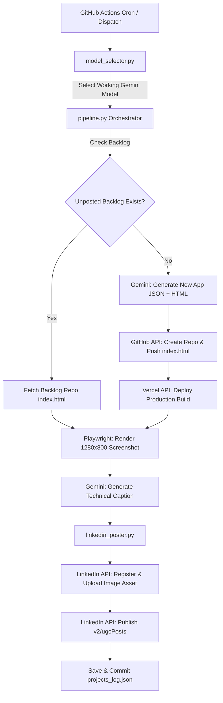

# Automated LinkedIn Project Pipeline — Complete Technical Architecture & Guide

This document provides a comprehensive technical overview of the **Automated LinkedIn Project Pipeline**. It details system architecture, component mechanics, API integration flows, data structures, and identified areas for future enhancement. It is structured specifically for code review and analysis by AI systems (e.g. Claude) or senior software engineers.

---

## 1. System Architecture Overview

The system is a **100% autonomous, zero-touch "Build in Public" engine** running on GitHub Actions. Every 10 days, it automatically generates a complete web application, deploys it to production, takes a visual screenshot, and publishes an engineering-focused update to a personal LinkedIn profile.



---

## 2. Core Components & Technical Implementation

### A. Workflow Schedule & Infrastructure (`.github/workflows/autoproject.yml`)
- **Execution Schedule**: `cron: '0 9 1,11,21 * *'` (Runs at 09:00 UTC on the 1st, 11th, and 21st of every month ~ every 10 days).
- **Environment**: `ubuntu-latest`, Python 3.12.
- **Dependencies Installed**: `requests`, `playwright` with Chromium headless browser (`playwright install chromium --with-deps`).
- **Permissions**: `contents: write` (allows auto-committing project execution logs back to GitHub).
- **Secrets & Credentials**:
  - `GEMINI_API_KEY`: Google Gemini API key.
  - `VERCEL_TOKEN`: Vercel Deployment REST API token.
  - `PIPELINE_GITHUB_TOKEN`: GitHub Personal Access Token (PAT) with `repo` and `administration` scope (to create new repositories under the user account).
  - `LINKEDIN_ACCESS_TOKEN`: OAuth 2.0 User Access Token.
  - `LINKEDIN_PERSON_URN`: Authenticated member URN (`urn:li:person:...`).

---

### B. Dynamic Model Selector (`model_selector.py`)
- **Purpose**: Prevents pipeline failure when individual Gemini models hit rate limits (429), quota exhaustion, or deprecation.
- **Mechanics**:
  1. Queries `GET https://generativelanguage.googleapis.com/v1beta/models` using `GEMINI_API_KEY`.
  2. Filters active models supporting `generateContent`.
  3. Sorts candidate models against an ordered preference list (e.g. `gemini-2.0-flash-lite`, `gemini-1.5-flash`, `gemini-pro`).
  4. Performs a live lightweight test prompt for each candidate.
  5. Selects the first passing model for the pipeline run.

---

### C. Core Orchestrator (`pipeline.py`)
- **Backlog Priority Mechanism**:
  - Before generating new projects, `pipeline.py` checks `projects_log.json` for any project entries where `"posted_to_personal_linkedin": false`.
  - If an unposted project exists (e.g. projects created prior to account authorization), it fetches `index.html` from `raw.githubusercontent.com`, captures its screenshot, generates a technical caption, and posts it to LinkedIn.
  - Only when all backlog projects are marked `"posted_to_personal_linkedin": true` does it proceed to generate new app ideas.
- **App Generation Prompt Engineering**:
  - Prompt enforces single-file HTML/CSS/JS applications with zero external dependencies (except CDN links if required).
  - Explicitly restricts concepts to **professional developer tools, productivity utilities, web audio/canvas engines, or data visualizers** (filtering out simple toy concepts).
  - Enforces dark mode styling, responsive layouts, and technical highlights.
- **GitHub Repository Creator**:
  - Calls `POST https://api.github.com/user/repos` to create a public repository.
  - Pushes `index.html` and a formatted `README.md` via `PUT /repos/{owner}/{repo}/contents/{path}`.
- **Vercel Production Deployer**:
  - Calls `POST https://api.vercel.com/v13/deployments`.
  - Sends inline `index.html` source payload for zero-build deployment.
  - Polls `GET /v13/deployments/{id}` every 5s until `readyState == "READY"`.
- **Playwright Headless Screenshot Engine**:
  - Launches Chromium browser with `1280x800` viewport.
  - Loads HTML content, waits 2.5s for CSS animations and Canvas rendering loops to complete, and exports `screenshot.png`.
- **LinkedIn Caption Prompt Engineering**:
  - Voice: Authentic first-person software engineer ("Just built...", "Created a tool for...").
  - Technical Depth: Emphasizes underlying architecture (Web Audio API, Canvas loops, client-side state management, zero dependencies).
  - Strict Link Restriction: Restricts output URLs to **ONLY two links**:
    1. 🌐 `Live Site: <vercel_url>`
    2. 📦 `Code Repo: <github_url>`
  - Hashtags: 3-4 clean tech tags (`#buildinpublic #webdev #javascript #softwareengineering`).

---

### D. LinkedIn Publisher & Media Engine (`linkedin_poster.py`)
- **Token Diagnostics & Resolution**:
  - Queries `GET https://api.linkedin.com/v2/userinfo` to verify the identity of the authenticated user (`name`, `sub`).
  - Attempts `GET https://api.linkedin.com/v2/me` to resolve legacy member IDs.
- **Binary Image Asset Upload Flow**:
  1. **Register Upload**: `POST https://api.linkedin.com/v2/assets?action=registerUpload` with `digitalmediaRecipe:feedshare-image`. Receives `asset` URN (`urn:li:digitalmediaAsset:...`) and `uploadUrl`.
  2. **Upload Binary**: Sends raw PNG byte stream via `PUT <uploadUrl>`.
  3. **Publish Media Post**: Passes `asset_urn` into `shareMediaCategory: IMAGE` within `/v2/ugcPosts`.
- **Dual-Endpoint Posting Engine**:
  - **Primary**: `POST https://api.linkedin.com/v2/ugcPosts` (the standard, proven endpoint for personal profiles).
  - **Fallback**: `POST https://api.linkedin.com/rest/posts` (REST Posts API).

---

### E. OAuth Setup Utility (`setup_linkedin.py`)
- **Purpose**: Solves LinkedIn's 60-day token limit via a local 1-click authorization helper.
- **Mechanics**:
  - Runs local TCP HTTP server listening on `http://localhost:8585/callback`.
  - Opens system browser to LinkedIn OAuth authorization screen with scopes: `openid profile w_member_social`.
  - Captures callback `code` and exchanges it for `access_token` and `expires_in` via `POST https://www.linkedin.com/oauth/v2/accessToken`.
  - Prints clean outputs formatted for copy-pasting directly into GitHub Repository Secrets.

---

## 3. Persistent Data Schema (`projects_log.json`)

```json
[
  {
    "title": "Example Project",
    "description": "A browser-based utility demonstrating the pipeline output format.",
    "status": "logged",
    "repo_url": "https://github.com/<your-username>/example-project-20260809-183528",
    "live_url": "https://example-project-20260809-183528.vercel.app",
    "linkedin_success": true,
    "posted_to_personal_linkedin": true,
    "timestamp": "2026-08-09T18:35:47.895639"
  }
]
```

---

## 4. Key Questions & Prompts for Claude Analysis

When sharing this project documentation with Claude or senior engineers, copy and paste the prompt below:

> *"Here is the complete architecture documentation and codebase breakdown for my automated 'Build in Public' LinkedIn project pipeline. Please review the system architecture, component breakdown, and data flow, and answer the following:*
> 1. **Code & Architecture Review**: What are the top 3 architectural bottlenecks or single points of failure in this pipeline?
> 2. **Token Management**: LinkedIn tokens expire every 60 days. How can we make token refresh even more seamless or automated within LinkedIn's API policies?
> 3. **Framework Expansion**: Currently, the pipeline generates single-file HTML/CSS/JS apps for zero-build Vercel deployment. How would you recommend scaling the generator to build multi-file Vite or Next.js projects efficiently?
> 4. **Post Quality & Visuals**: How can we further improve the Playwright screenshot rendering (e.g. adding browser device mockups or animated GIFs) to maximize LinkedIn post engagement?"*

---

*Document prepared for project review and AI systems analysis.*
