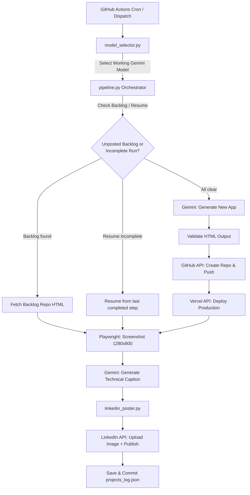

# Auto Project Pipeline

> **Autonomous "Build in Public" engine** — every 10 days, this pipeline
> generates a complete web app with Gemini, deploys it to Vercel, creates
> a GitHub repo, screenshots it with Playwright, and posts an engineering
> update to your LinkedIn profile. Zero touch required (except re-authing
> LinkedIn every ~60 days).

> [!WARNING]
> **LinkedIn Terms of Service Disclaimer**: Automated posting may violate
> LinkedIn's Terms of Service. Each self-hoster is **solely responsible**
> for compliance with LinkedIn's policies and any risks to their account.
> This tool is provided as-is under the MIT License.

---

## Architecture



## How Project Concepts Are Selected

The Gemini generation prompt is tuned to produce **professional developer
tools, productivity utilities, web audio/canvas engines, and data
visualizers**. It explicitly avoids toy or childish concepts. Each run
checks the project log to avoid repeating past ideas, and validates the
generated HTML before deploying it.

---

## Quickstart

### 1. Clone and configure

```bash
git clone https://github.com/<your-username>/auto-project-pipeline.git
cd auto-project-pipeline
cp .env.example .env
# Fill in your API keys — see .env.example for where to get each one
```

### 2. Set up LinkedIn OAuth

```bash
pip install requests
python setup_linkedin.py
```

Follow the prompts — it opens your browser, you click "Allow," and it
prints three values to paste into your `.env` (or GitHub Secrets):

- `LINKEDIN_ACCESS_TOKEN`
- `LINKEDIN_PERSON_URN`
- `LINKEDIN_TOKEN_EXPIRES_AT`

**Repeat this step every ~60 days** when the pipeline warns you.

### 3. Test locally

```bash
pip install -r requirements.txt
DRY_RUN=true python pipeline.py
```

`DRY_RUN=true` runs the full pipeline (generation → GitHub → Vercel →
screenshot) but skips the actual LinkedIn POST.

### 4. Deploy to GitHub Actions

Push your repo and add all secrets from `.env.example` to your repo's
**Settings → Secrets and variables → Actions**. The pipeline will run
automatically on the 1st, 11th, and 21st of every month.

---

## All Secrets / Environment Variables

| Variable | Required | Where to get it |
|---|---|---|
| `GEMINI_API_KEY` | ✅ | [aistudio.google.com/apikey](https://aistudio.google.com/apikey) |
| `PIPELINE_GITHUB_TOKEN` | ✅ | [github.com/settings/tokens](https://github.com/settings/tokens) — needs `repo` + `admin` scope |
| `VERCEL_TOKEN` | ✅ | [vercel.com/account/tokens](https://vercel.com/account/tokens) |
| `GITHUB_REPOSITORY_OWNER` | ✅ | Your GitHub username (set automatically in Actions via `github.repository_owner`) |
| `LINKEDIN_ACCESS_TOKEN` | ✅* | Output of `setup_linkedin.py` (expires ~60 days) |
| `LINKEDIN_PERSON_URN` | ✅* | Output of `setup_linkedin.py` (permanent) |
| `LINKEDIN_TOKEN_EXPIRES_AT` | Optional | Output of `setup_linkedin.py` (for expiry warnings) |
| `GMAIL_USER` | Optional | Your Gmail address (for email notifications) |
| `GMAIL_APP_PASSWORD` | Optional | [myaccount.google.com/apppasswords](https://myaccount.google.com/apppasswords) |
| `NOTIFY_EMAIL` | Optional | Defaults to `GMAIL_USER` |
| `TEST_MODE` | Optional | `true` to skip all external writes |
| `DRY_RUN` | Optional | `true` to skip only the LinkedIn POST |

*LinkedIn secrets are required for posting but the pipeline won't crash without them.

---

## State Machine & Reliability

Each project progresses through a tracked state machine:

```
generated → repo_created → deployed → screenshotted → posted → logged
```

If the pipeline crashes mid-run (e.g., Vercel timeout, rate limit), the
next run **resumes from the last completed step** rather than starting
from scratch. This prevents duplicate repos or double-posting.

All external API calls use exponential backoff with tenacity (retries on
429/502/503/504, immediate failure on 401/403).

---

## Files

| File | Purpose |
|---|---|
| `pipeline.py` | Main orchestrator — state machine, generation, deploy, post |
| `model_selector.py` | Finds a working Gemini model via live testing |
| `linkedin_poster.py` | LinkedIn auth, image upload, dual-endpoint posting |
| `setup_linkedin.py` | Run locally every ~60 days for a new OAuth token |
| `common.py` | Shared error hierarchy, structured JSON logging, retry helpers |
| `validators.py` | HTML validation for Gemini output (CDN allowlist, structure checks) |
| `projects_log.json` | Persistent project history with state tracking |
| `.env.example` | Template for all required environment variables |
| `.github/workflows/autoproject.yml` | Cron schedule + Actions config |
| `.github/workflows/ci.yml` | Lint + test on every PR |

---

## Contributing

See [CONTRIBUTING.md](CONTRIBUTING.md) for setup, testing, and PR instructions.

## License

[MIT](LICENSE)
